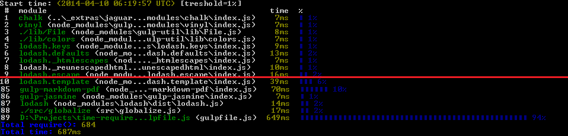
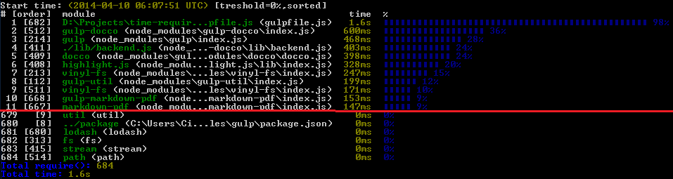

# `gulpt` @ [](http://oss.jaguard.com)

> [gulp.js](http://gulpjs.com/) CLI wrapper that use [time-require](https://github.com/jaguard/time-require) to measure & report all the `require()` calls from your gulpfile.js. Simply use it instead of `gulp` CLI to measure & speed up your `gulpfile.js` build `require()` calls.

## Project status
- NPM version: [](https://www.npmjs.org/package/gulpt)
- NPM downloads: [](https://www.npmjs.org/package/gulpt)
- GitHub release: [](https://github.com/jaguard/gulpt)
- Dependencies: [](https://david-dm.org/jaguard/time-require#info=dependencies)

## Install

Globally install with [npm](https://npmjs.org/package/gulpt)
```
npm install -g gulpt
```

## Usage

Now that `gulpt` is available on PATH, invoke it as you're using `gulp`. Additional parameters could be passed to [time-require](https://github.com/jaguard/time-require) (ex: `--sorted`, `--verbose`)
```
gulpt build --sorted
```

1. Default usage (non-verbose) showing required modules in loaded order, above 1% treshold
```
gulpt -T
```


2. Verbose (all) & sorted usage showing all required modules in sorted order
```
gulpt -T --verbose --sorted
```


## License

[MIT](https://github.com/jaguard/gulpt/raw/master/LICENSE) &copy; [Jaguard OSS](http://oss.jaguard.com)

## Changelog

- v0.1.2 (2014.04.25)
	+ Fix https://github.com/jaguard/gulpt/issues/1
- v0.1.1 (2014.04.25)
	+ Add screenshoots
- v0.1.0 (2014.04.20)
	+ Published `gulpt` module to [npm](https://www.npmjs.org/package/gulpt)
	+ Initial release
